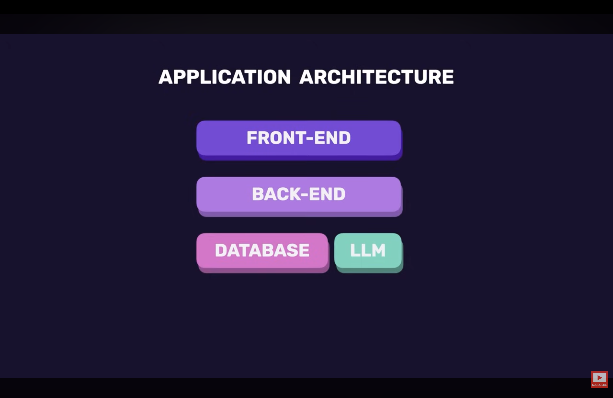
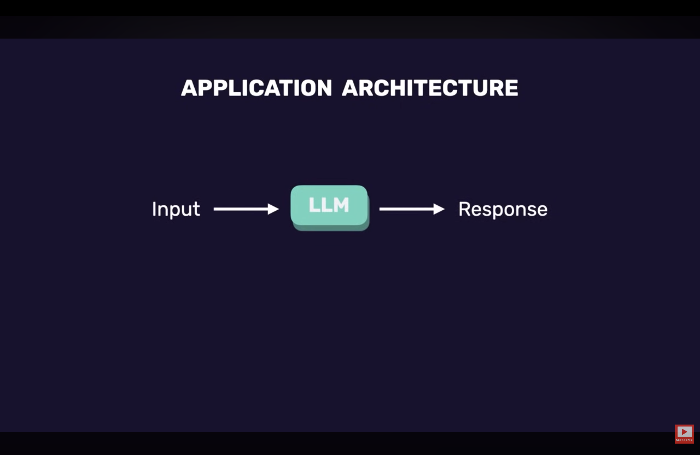

# How LLMs Fit Into Applications

Typical application architecture:

```text
Frontend
    ↓
Backend
    ↓
Database
    ↓
LLM
```



The LLM is usually **not the center of the application**.

It acts as a supporting component that:

1. Receives input
2. Generates output
3. Enhances the user experience



## Common LLM Use Cases

### 1. Summarization

Converts large content into concise summaries.

Examples:

- Product reviews
- Articles
- Reports
- Meeting notes

### 2. Content Generation

Creates:

- Emails
- Product descriptions
- Social media posts

### 3. Text Classification

Categorizes text into predefined groups.

Examples:

- Spam vs Non-spam
- Positive vs Negative review
- Support ticket categorization
    - Billing
    - Login issues
    - Cancellation requests

### 4. Structured Output

LLMs can return:

```json
{
    "category": "billing",
    "priority": "high"
}
```

This can be directly processed by backend systems.

### 5. Translation

Converts text between languages.

Examples:

- Social media translation
- Messaging apps
- Real-time translation features

### 6. Data Extraction

Extracts structured data from unstructured content.

#### Example

Input:

- Invoice PDF

Output:

```json
{
    "invoiceNumber": "INV001",
    "amount": 5000,
    "customer": "John Doe"
}
```

Useful for:

- Documents
- Forms
- Contracts
- Receipts

### 7. Chatbots

LLMs can power chatbots that:

- Answer customer questions
- Search company knowledge bases
- Interact with user data
- Provide support

## Core Pattern of LLM Applications

Almost all LLM applications follow the same workflow:

```text
Input (Prompt)
       ↓
      LLM
       ↓
Output (Response)
```

### Possible Outputs

The response may be:

- Plain text
- Numbers
- Arrays
- JSON objects
- Images
- Other structured formats
