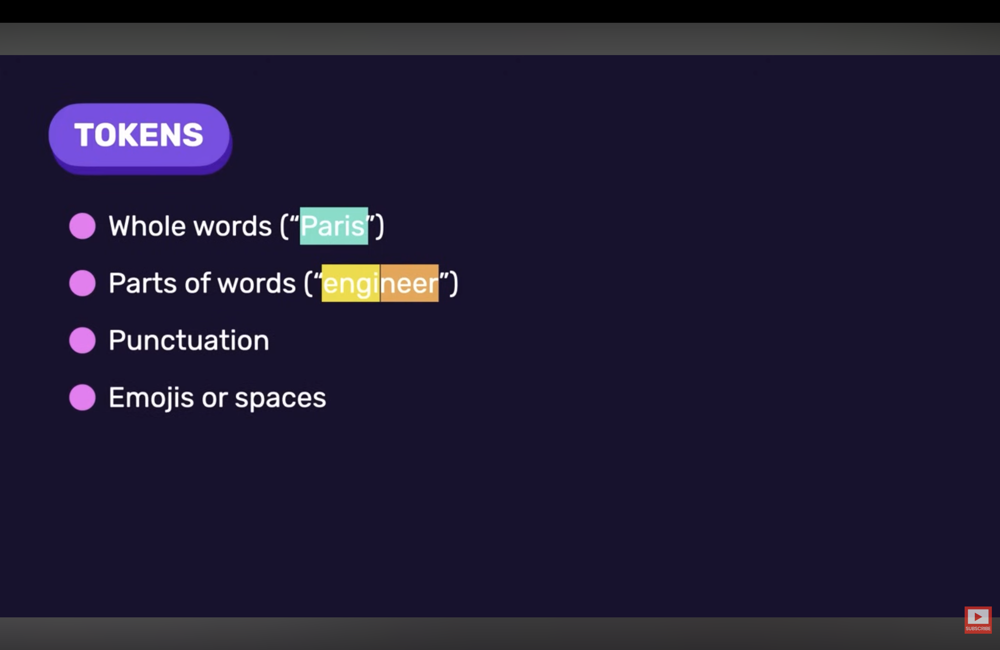
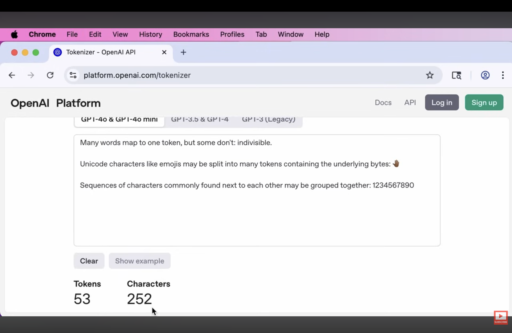
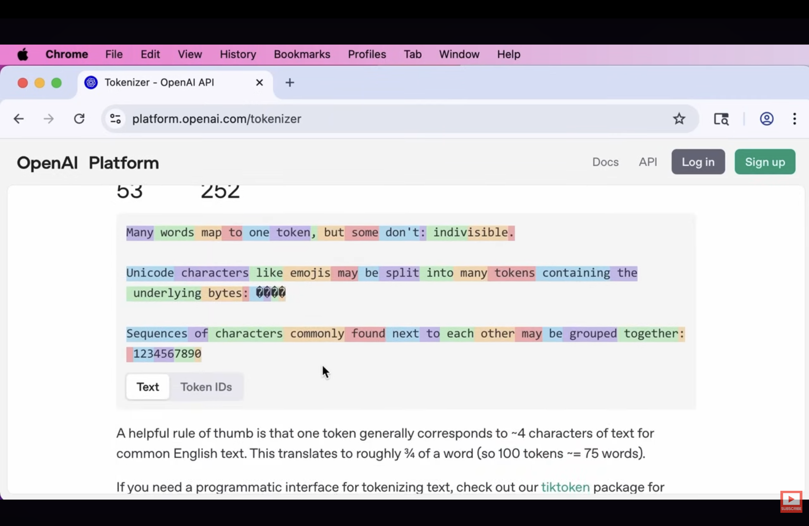
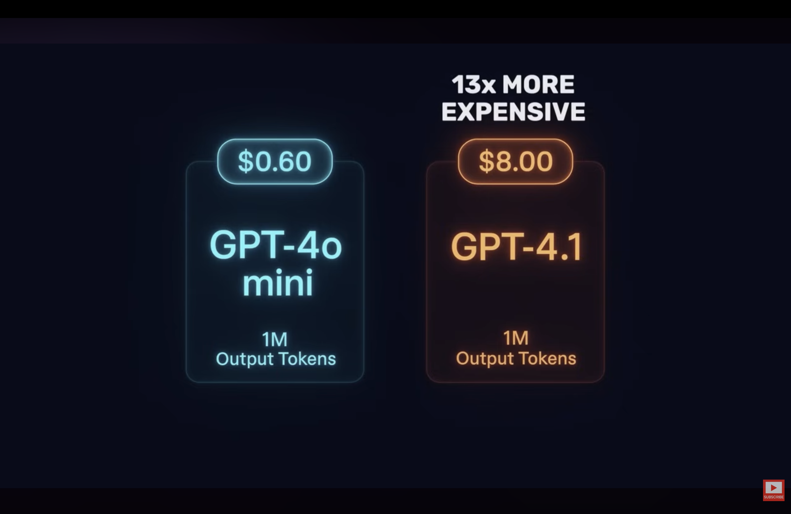

# What Are Tokens?

- When we send text to a language model, it does **not process raw text directly**.
- Instead, the text is broken into smaller units called **tokens**.

### Tokens Can Be:

- Whole words
- Parts of words
- Punctuation marks
- Spaces
- Emojis

- Tokens are **not the same as words or characters**.
- They lie somewhere in between.

## Counting Tokens

## Why Tokens Matter

Tokens directly affect:

1. Cost
2. Context limits
3. Performance

> Choose the model that satisfies your application's requirements at an acceptable cost.

# Context Window

- A model can only process a limited number of tokens at once.
- This limit is called the **Context Window**.

### Context Window Includes

1. User prompt (input)
2. Model's response (output)
3. Chat history (for conversations)

All measured in tokens.

## What Happens When the Limit Is Reached?

If the total number of tokens exceeds the context window:

- The model cannot process additional content.
- Responses may stop abruptly.
- The model may cut off in the middle of a sentence.

So, developers should:

- Monitor token usage
- Choose a suitable context window
- Avoid sending unnecessarily large prompts
