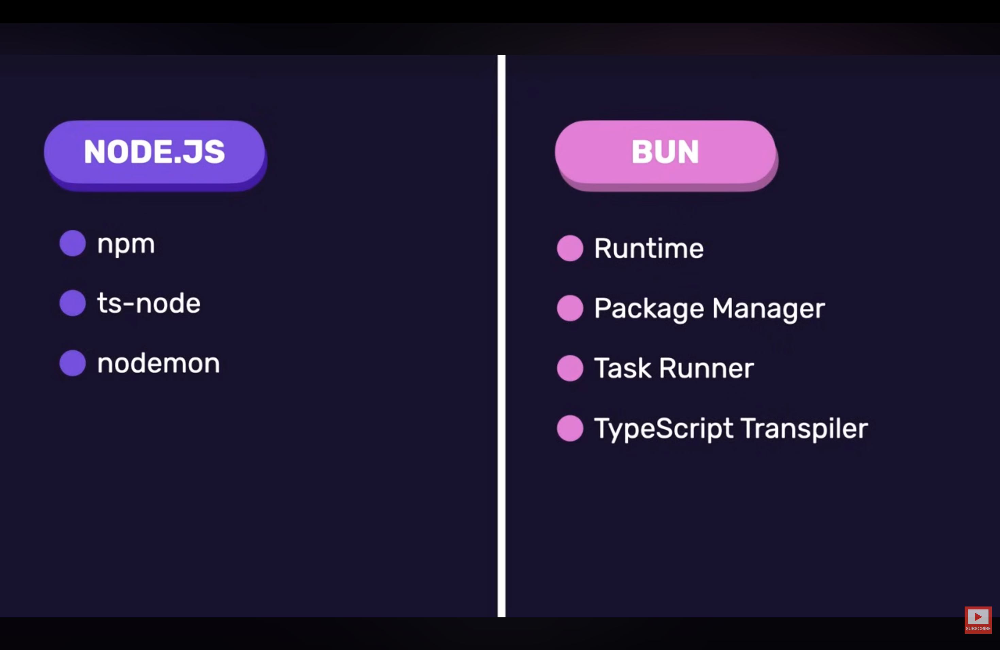

# Bun

- **Bun** is a modern JavaScript runtime.
- It is similar to **Node.js**, but it is significantly faster and comes with many built-in tools.

## Node.js vs Bun

A typical Node.js project relies on multiple tools:

1. **npm** - for installing packages
2. **ts-node** - for running TypeScript files
3. **nodemon** - for automatically restarting the server when files change

With **Bun**, all of these capabilities are integrated into a single tool.

### Bun provides:

- Runtime
- Package Manager
- Task Runner
- TypeScript Transpiler

Because Bun can transpile and execute TypeScript directly, we do not need additional tools such as `ts-node` to get started.



## Install Bun

Official website:

```
https://bun.sh/
```

Install Bun:

```bash
curl -fsSL https://bun.sh/install | bash
```
