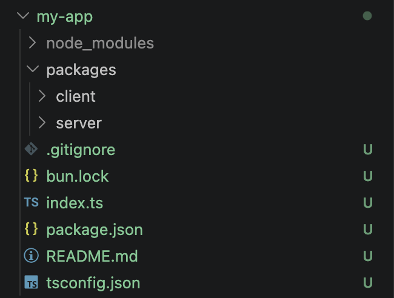

# Creating the Project Structure

Create a new directory and run:

```bash
bun init
```

This is similar to:

```bash
npm init
```

The command creates:

- `package.json`
- `bun.lock`
- starter files and configuration files

> Note: `bun init` may create configuration files for editors such as Cursor. We are not using them, so they can be safely deleted.

## Workspace

- To build a full-stack application, we will use **Bun Workspaces**.

- A **workspace** allows us to manage multiple related projects (such as a frontend and backend) from a single root directory.

- Although workspaces are available in Node.js package managers as well, Bun has built-in support for them.

### Common Folder Structure

By convention, sub-projects are placed inside a directory named `packages`.



### Declaring Workspaces

Inside the root `package.json`:

### Option 1

```json
{
    "workspaces": ["packages/client", "packages/server"]
}
```

### Option 2 (Recommended)

```json
{
    "workspaces": ["packages/*"]
}
```

### Explanation

- `workspaces` is an array of directory paths.
- Each path represents a package that belongs to the workspace.
- `packages/*` means:
    - Every folder inside the `packages` directory will automatically be treated as a workspace package.
