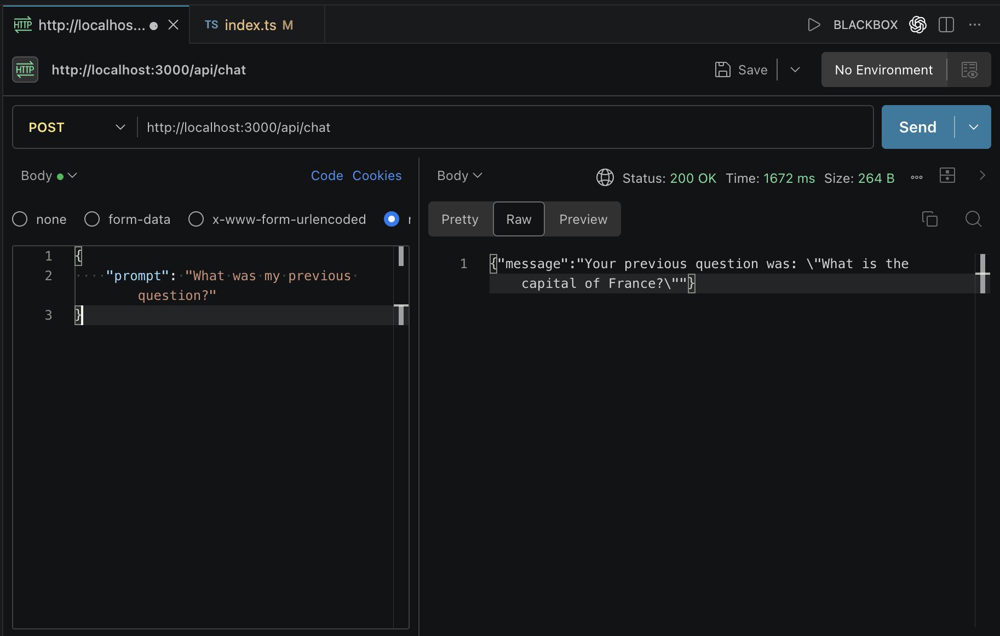
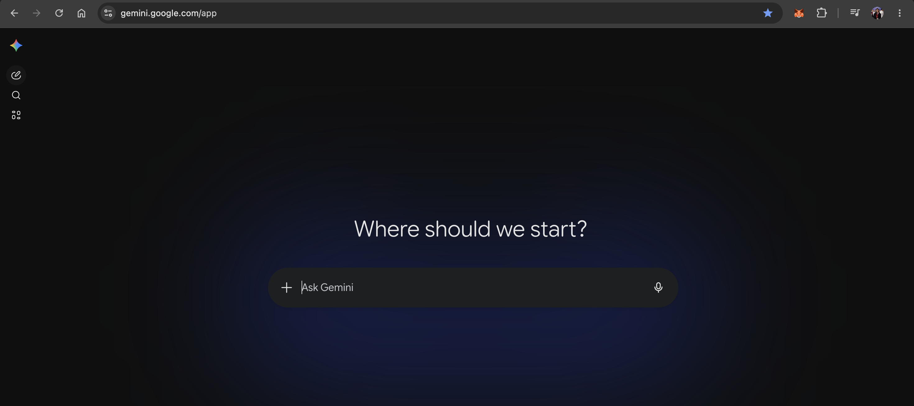
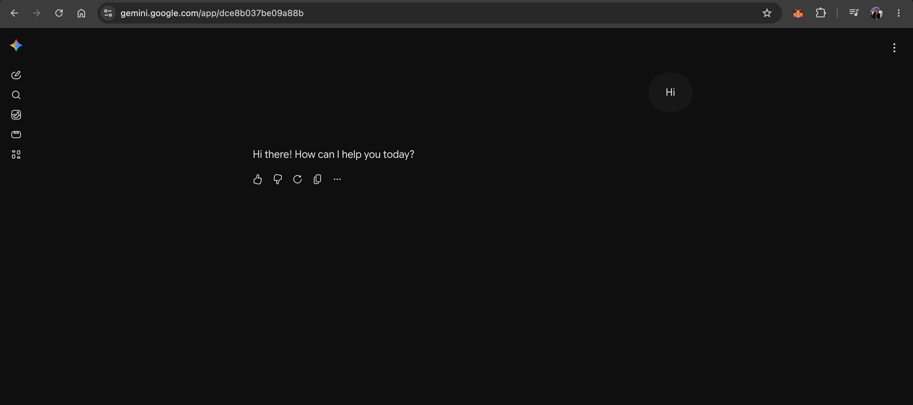
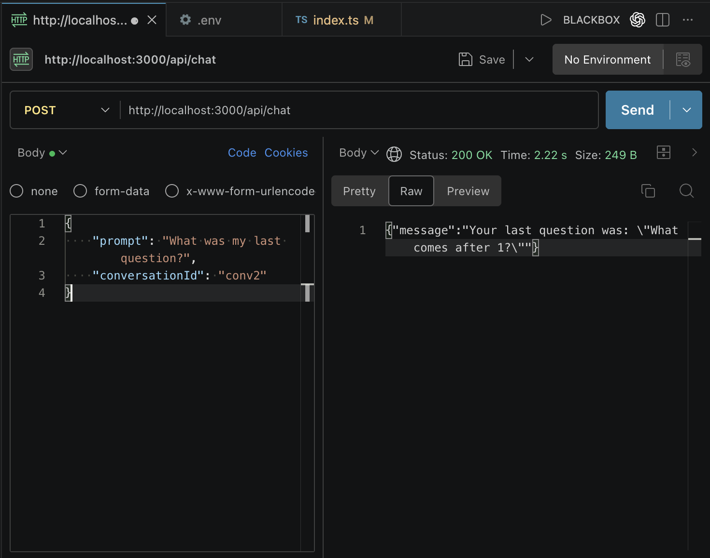

# Adding Memory

- Currently the chatbot has no memory.
- Each request is treated independently.
- The chatbot cannot remember the last response that was sent to it by the user.

## Simple Memory Solution

- Store conversation history in memory.

**Note:**

- Mosh uses OpenAI's `previous_response_id` to maintain conversation context between requests.
- Gemini does not provide an equivalent parameter.
- Instead, conversation continuity is achieved by sending the complete chat history with each request.

Create a global variable:

```ts
let chatHistory = [];
```

### Store User Messages

Whenever a user sends a message:

```ts
chatHistory.push({
    role: "user",
    parts: [{ text: prompt }],
});
```

### Send Entire History to Gemini

Instead of sending only the latest prompt:

```ts
contents: prompt;
```

send:

```ts
contents: chatHistory;
```

Example:

```ts
const response = await client.models.generateContent({
    model: "gemini-2.5-flash",
    contents: chatHistory,
    config: {
        temperature: 0.2,
        maxOutputTokens: 100,
    },
});
```

Now Gemini can see previous messages.

### Store Gemini Responses

After receiving the response:

```ts
chatHistory.push({
    role: "model",
    parts: [{ text: response.text }],
});
```



## Problem With This Approach

- It supports only one conversation.

If:

- Multiple users use the app OR
- One user opens multiple chats

all messages get mixed together.

- This is not acceptable in a real-world application.

## Better Solution: Use a Map

Store a separate chat history for every conversation.

```ts
const conversations = new Map<string, any[]>();
```

Mapping:

```text
conversationId → chatHistory
```

Example:

```text
conv1 → history1
conv2 → history2
```

Each conversation maintains its own context.

### Step 1: Receive Conversation ID

Extract values:

```ts
const { prompt, conversationId } = req.body;
```

#### Why Do We Need a Conversation ID?

Notice how Gemini works:

Before chatting:



After starting a conversation, URL changes:



- Each chat gets a unique identifier.
- Similarly, our frontend generates a unique ID and sends it to the server, with every request.

### Step 2: Get Existing Chat History

```ts
const chatHistory = conversations.get(conversationId) || [];
```

### Step 3: Add User Message

```ts
chatHistory.push({
    role: "user",
    parts: [{ text: prompt }],
});
```

### Step 4: Send Entire History to Gemini

```ts
const response = await client.models.generateContent({
    model: "gemini-2.5-flash",
    contents: chatHistory,
    config: {
        temperature: 0.2,
        maxOutputTokens: 100,
    },
});
```

### Step 5: Save Gemini Response

```ts
chatHistory.push({
    role: "model",
    parts: [{ text: response.text }],
});
```

### Step 6: Save Updated History

```ts
conversations.set(conversationId, chatHistory);
```

- Now future requests with the same conversation ID will continue from previous messages.

### Conversation 1


### Conversation 2




### Back to Conversation 1


## Final Code

```ts
import express from "express";
import type { Request, Response } from "express";
import dotenv from "dotenv";
import { GoogleGenAI } from "@google/genai";

dotenv.config();

const client = new GoogleGenAI({
    apiKey: process.env.GEMINI_API_KEY,
});

const app = express();
app.use(express.json());
const port = process.env.PORT || 3000;

// Define a route
app.get("/", (req: Request, res: Response) => {
    res.send("Hello World!");
});

app.get("/api/hello", (req: Request, res: Response) => {
    res.json({
        message: "Hello World!",
    });
});

// conversationId -> chatHistory
const conversations = new Map<string, any[]>();

app.post("/api/chat", async (req: Request, res: Response) => {
    // 1. Take user's prompt from the chat
    const { prompt, conversationId } = req.body;

    const chatHistory = conversations.get(conversationId) || [];

    chatHistory.push({
        role: "user",
        parts: [{ text: prompt }],
    });

    // 2. Send prompt to Gemini
    const response = await client.models.generateContent({
        model: "gemini-2.5-flash-lite",
        contents: chatHistory,
        config: {
            temperature: 0.2,
            maxOutputTokens: 100,
        },
    });

    chatHistory.push({
        role: "model",
        parts: [{ text: response.text }],
    });

    conversations.set(conversationId, chatHistory);

    // 3. Return the JSON object
    res.json({
        message: response.text,
    });
});

// Start the server
app.listen(port, () => {
    console.log(`Server is running on http://localhost:${port}`);
});
```
