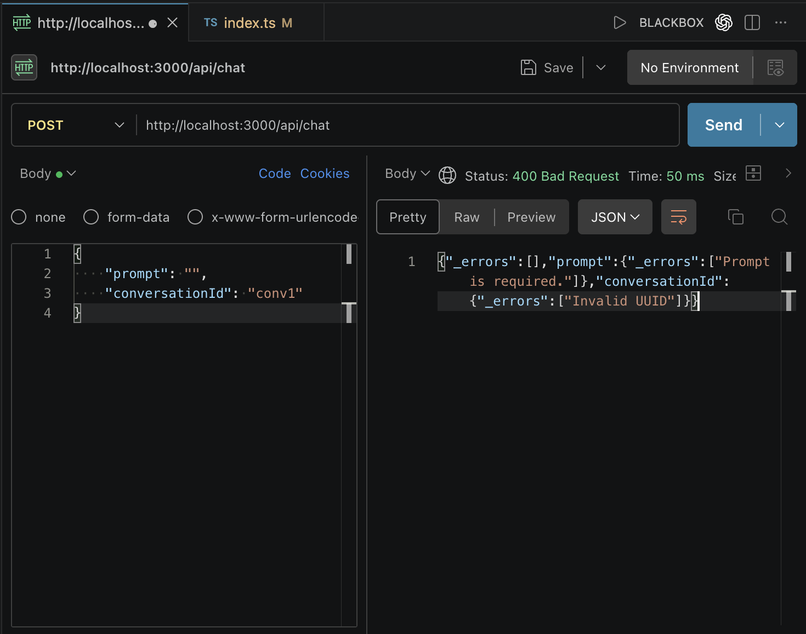

# Input Validation

- Input validation ensures that incoming request data has the correct structure and contains valid values before we process it.
- For validation, we will use **Zod**.

> Zod is a schema validation library commonly used in both React and Node.js applications.

## Install Zod

Inside the `server` directory:

```bash
bun add zod
```

- With Zod, we can define the shape of incoming objects, such as request data, and easily validate them.

### Step 1: Import Zod

```ts
import z from "zod";
```

### Step 2: Define the Schema

- A schema defines the expected shape of incoming data.
- We use `z.object()` to define the structure of the request body.
- While using it, we can chain multiple methods to define validation rules.

Our request body should contain:

#### 1. `prompt`

Requirements:

- Must be a string
- Must contain at least 1 character
- Must not exceed 1000 characters

Why?

- Prevent empty prompts
- Prevent users from sending huge amounts of text
- Reduce unnecessary token consumption

#### 2. `conversationId`

Requirements:

- Must be a string
- Must be a valid UUID

Why?

- Every conversation should have a unique identifier
- Prevent invalid conversation IDs from being used

> UUID: Universally Unique Identifier

### Schema Definition

```ts
const chatSchema = z.object({
    prompt: z
        .string()
        .min(1, "Prompt is required.")
        .max(1000, "Prompt is too long (max 1000 characters)"),

    conversationId: z.string().uuid(),
});
```

### Step 3: Validate Incoming Data

- Use `safeParse()` to validate the request body.
- In the response body, we want to send the error message back to the client.
- We can do this using `parseResult.error.format()`.

```ts
const parseResult = chatSchema.safeParse(req.body);

if (!parseResult.success) {
    res.status(400).json(parseResult.error.format());
    return;
}
```

`400 Bad Request` means:

> The client sent invalid data.

Examples:

- Missing prompt
- Invalid UUID
- Wrong data type

### Why Return Immediately?

```ts
return;
```

prevents the remaining code from executing.

- Without it, the server would continue processing invalid data.

### Understanding the Error Object



- `parseResult.error.format()` returns a structured object.

Example:

```ts
{
    _errors: [],
    prompt: {
        _errors: ["Prompt is required."]
    },
    conversationId: {
        _errors: ["Invalid UUID"]
    }
}
```

### Error Object Properties

#### 1. `_errors`

Contains general validation errors.

#### 2. `prompt`

Contains validation errors related to the prompt field.

#### 3. `conversationId`

Contains validation errors related to the conversation ID.

### Problem With Current Validation

Consider this input:

```json
{
    "prompt": "     "
}
```

- This passes validation because its length > 1.
- Even though the prompt contains no meaningful content.

This is not desirable.

### Solution: Use `trim()`

- Before checking the length, remove leading and trailing whitespace.

Updated schema:

```ts
const chatSchema = z.object({
    prompt: z
        .string()
        .trim()
        .min(1, "Prompt is required.")
        .max(1000, "Prompt is too long (max 1000 characters)"),

    conversationId: z.string().uuid(),
});
```

### Updated Validation Setup

```ts
const conversations = new Map<string, any[]>();

const chatSchema = z.object({
    prompt: z
        .string()
        .trim()
        .min(1, 'Prompt is required.')
        .max(1000, 'Prompt is too long (max 1000 characters)'),

    conversationId: z.string().uuid(),
});

app.post('/api/chat', async (req: Request, res: Response) => {
    // Validate input data
    const parseResult = chatSchema.safeParse(req.body);

    if (!parseResult.success) {
        res.status(400).json(parseResult.error.format());
        return;
    }

    // Take user's prompt from the chat
    const { prompt, conversationId } = req.body;

    ...
});
```
