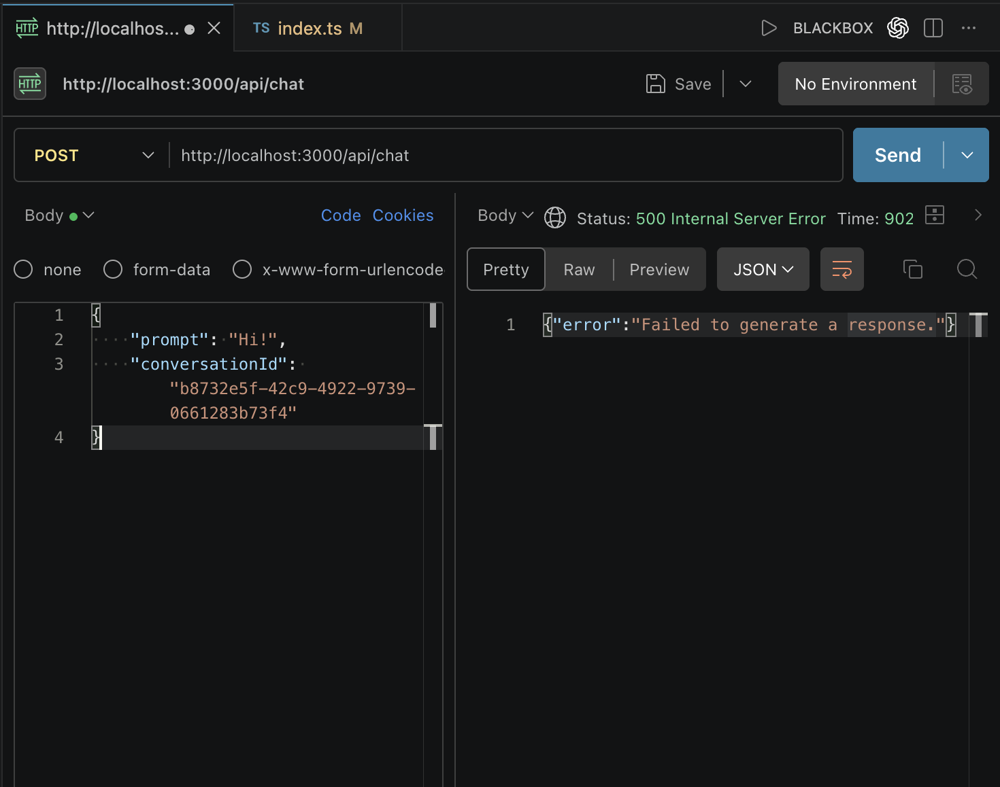

# Handling Errors

- Validation errors are not the only errors that can occur.

The following line may fail:

```ts
const response = await client.models.generateContent(...)
```

### Possible Reasons

1. Network Failure
2. Gemini Service Outage
3. Rate Limits / Token Limits

We may:

- Run out of quota
- Exceed rate limits
- Hit API restrictions

## Using Try-Catch

- To handle runtime errors gracefully, wrap the application logic inside a `try-catch` block.

```ts
app.post("/api/chat", async (req: Request, res: Response) => {
    // Validate input data
    const parseResult = chatSchema.safeParse(req.body);

    if (!parseResult.success) {
        res.status(400).json(parseResult.error.format());
        return;
    }

    try {
        const { prompt, conversationId } = req.body;

        const chatHistory = conversations.get(conversationId) || [];

        ...

        res.json({
            message: response.text,
        });
    } catch (error) {
        res.status(500).json({
            error: "Failed to generate a response.",
        });
    }
});
```

- Move the entire code responsible for getting the AI response inside the try block.

### Understanding the Catch Block

- It captures any exception thrown inside the `try` block.

### Response Sent

```ts
res.status(500).json({
    error: "Failed to generate a response.",
});
```

1. Set the status code to `500`.
2. Return a JSON object with an `error` property.

### Status Code 500

`500 Internal Server Error`

Meaning:

> Something went wrong on the server while processing the request.

This indicates that:

- The client request was valid
- The failure occurred on the server side


