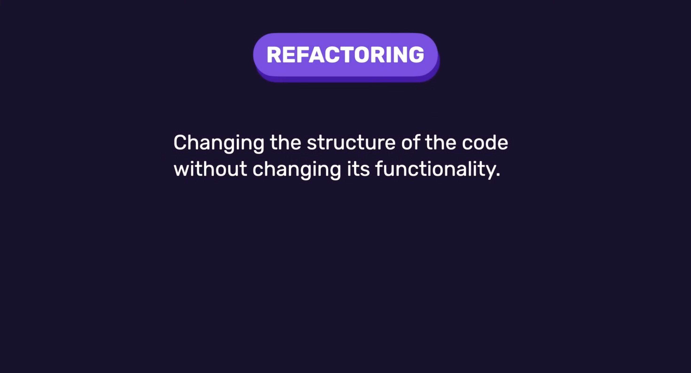
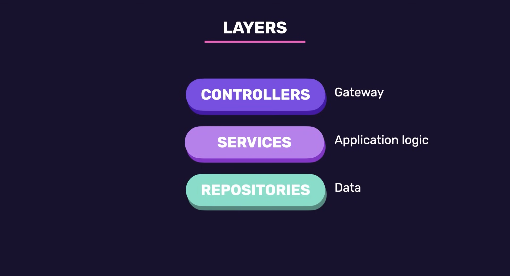

# Refactoring the Application

- So far, everything exists inside `index.ts` file.
- This works for small projects but becomes difficult to maintain as the application grows.

## Problem: No Separation of Concerns

Currently:

- Route handling
- Validation
- Business logic
- Data storage

are all mixed together.

### Solution: Layered Architecture

- We will split responsibilities into different layers.

Each layer should have:

> One responsibility and one responsibility only.

This concept is known as:

> Separation of Concerns (SoC)

## Three-Layer Architecture

### 1. Controllers Layer

Controllers are responsible for:

- Receiving HTTP requests
- Validating request data
- Calling services
- Returning HTTP responses

Think of a controller as:

> The receptionist of a building.

Controllers act as the **gateway to our application**.

### 2. Services Layer

- Services contain the **actual application logic**.
- This is where business rules live.

Examples:

- Calling Gemini
- Processing data
- Making decisions
- Coordinating multiple repositories

### 3. Repository Layer

- Repositories are responsible for **data access**.

Whenever we need to:

- Store data
- Retrieve data
- Update data
- Delete data

we work through repositories.

#### Important Idea

- The service should not care where the data is stored.
- Data could be stored in memory or the database.

The repository abstracts those implementation details.

### Benefits of This Architecture

- By following this architecture, our codebase becomes much easier to manage.
- If something breaks or needs to change, we know exactly where to look.
- It also improves readability because each layer or module has a single, clear responsibility.

Overall, it makes our application more scalable because we can reuse and test each piece independently, and plug it into other features without duplicating code.
