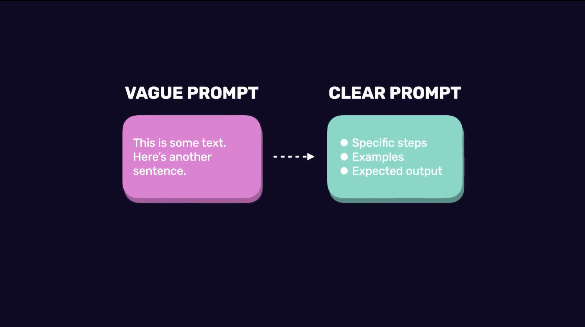

# Introduction to Prompt Engineering

## What is Prompt Engineering?

- **Prompt engineering** is the process of writing better instructions (prompts) to get more useful and accurate results from a language model.

- Despite sounding complex, it simply means **learning how to communicate effectively with an AI model**.

Even **small differences** in how a prompt is written can dramatically change the output.


## Example: Vague vs Clear Prompt

### Vague Prompt

```text
Summarize this text.
```

Problems:

- No summary length specified.
- No target audience specified.
- No output format specified.

The model has to make assumptions.

### Improved Prompt

```text
Summarize the following product reviews in three short bullet points.
Focus on common themes and use simple language.
```

Why it is better:

- Specifies the task (summarization)
- Defines the output format (bullet points)
- Specifies the length (three short points)
- Indicates what to focus on (common themes)
- Defines the writing style (simple language)

This makes the prompt **structured** and easier for the model to follow.


