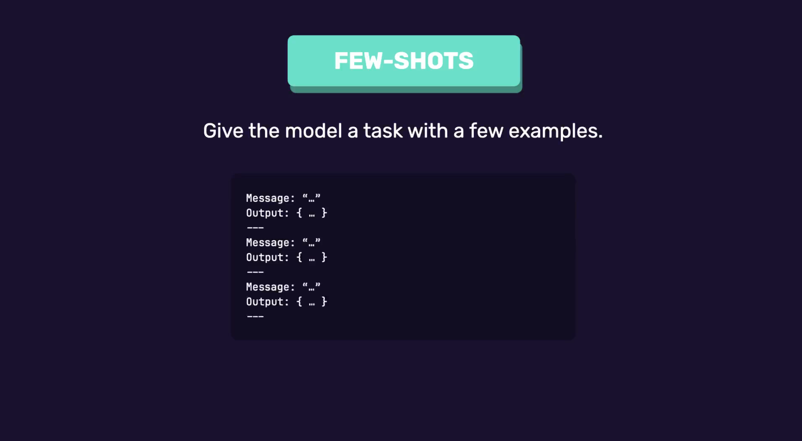

# Prompting Strategies

There are three common prompting strategies:

1. Zero-shot prompting
2. One-shot prompting
3. Few-shot prompting

The main difference between them is **how many examples** are provided to the model.

## 1. Zero-Shot Prompting

- **Zero-shot prompting** is the simplest prompting strategy.
- The model is given **a task with no examples**.

The model relies entirely on its pre-trained knowledge to complete the task.

### Example

```text
Classify this product review as:
- Positive
- Neutral
- Negative
```

### Why It Works

- Tasks like **sentiment analysis** are common NLP problems.
- LLMs have seen thousands of similar examples during training, so they generally know how to perform the task without additional examples.

### Importance of Clear Instructions

- Even in zero-shot prompting, it's important to clearly specify the allowed outputs.

Instead of simply asking:

```text
Classify this review.
```

Specify the valid values:

```text
Positive
Neutral
Negative
```

### Why?

Without constraints, the model may return inconsistent outputs such as:

- Somewhat happy
- Positive sentiment
- A complete explanatory sentence

These responses are difficult to use programmatically.

Providing explicit allowed values leads to:

- More reliable outputs
- More consistent outputs
- Easier integration with code

### When Zero-Shot Isn't Enough

Zero-shot prompting may fail when:

- The desired output format is specific.
- The task requires following a particular structure.

For example:

```text
Turn this review into a JSON object.
```

Without guidance, the model may:

- Invent its own JSON schema.
- Return inconsistent structures.

## 2. One-Shot Prompting

**One-shot prompting** means providing **one example** to demonstrate the expected output.

The example teaches the model:

- The required structure
- Field names
- Output format
- Expected values

### Example

Suppose we want:

```json
{
    "sentiment": "positive"
}
```

Providing one example tells the model:

- Use the key `"sentiment"`
- Return values in the expected format
- Follow the same JSON structure

### When One-Shot Isn't Enough

Some tasks require the model to infer multiple pieces of information.

### Example

Analyze customer support messages and return:

```text
intent
urgency
mentions_order
```

If only one example is provided, the model may not understand:

- Valid values for `intent`
- How to determine `urgency`
- When `mentionsOrder` should be `true` or `false`

## 3. Few-Shot Prompting

- **Few-shot prompting** provides **multiple examples** for the model to learn from.
- Instead of explaining every rule explicitly, the examples teach the model the desired behavior.

This is useful for:

- Complex tasks
- Tasks involving multiple fields
- Tasks requiring inference
- Tasks with custom labels or categories



### How Many Examples?

- There is **no fixed or magic number**.
- A general rule of thumb is:
    - **3–5 well-written examples** are usually sufficient.

- However, the exact number depends on the complexity of the task.
- More complex tasks may require more examples.

### Characteristics of Good Few-Shot Examples

Examples should be:

1. High Quality
2. Clear and Unambiguous
3. Consistently Formatted
4. Diverse: Covering different use cases
5. Include Edge Cases
