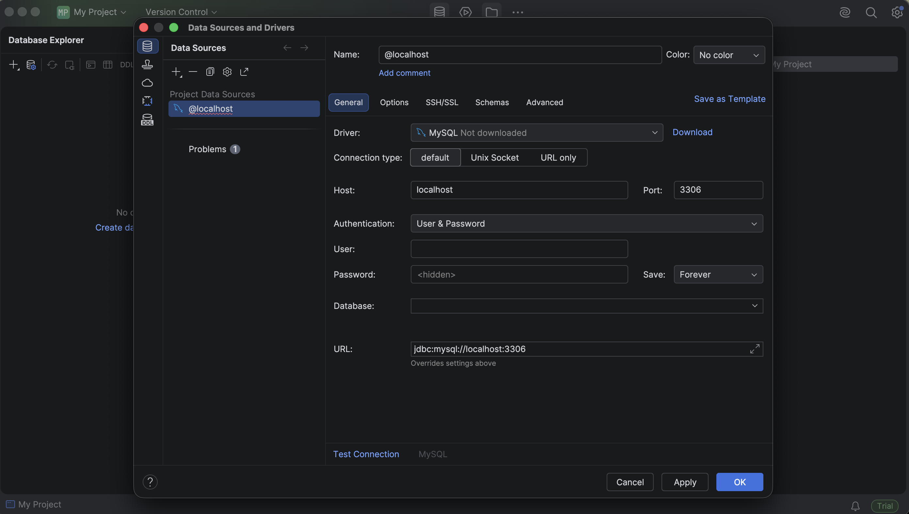
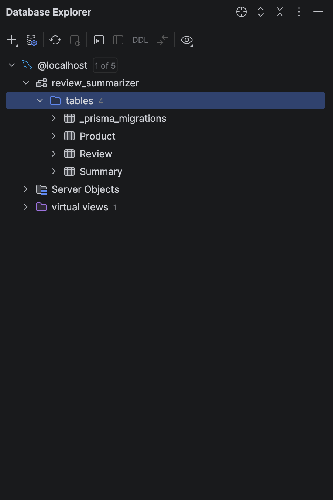

# Prisma Migrations

- We have defined our schema.
- Now we need to create the actual database tables.
- This is done using **migrations**.

## Migration

- A migration is a way to create, update, and manage database tables so that the database schema stays in sync with our application's code.
- Whenever the schema changes, a new migration should be created.

Create a new migration:

```bash
bunx prisma migrate dev
```

- Since this is the first migration, Prisma asks for a name.
- As the project grows, we will create a new migration whenever the schema changes.
- Give each migration a descriptive name, just like meaningful Git commit messages.

## Viewing the Database

To inspect the database visually, we can use **DataGrip**.

### Steps

1. Install DataGrip.
2. Create a new project.
3. Add a new data source.
4. Select **MySQL**.
5. Enter the connection details.



```
Username: root
Password: <your MySQL password>
```

6. Download the required drivers.
7. Click **Test Connection**.
8. If successful, click **OK**.

### Viewing the Tables

Select the schema: review_summarizer



We see four tables.

### 1. `_prisma_migrations`

- Used internally by Prisma.
- Keeps track of all migrations that have been applied.
- Never modify this table manually.

### 2. `Product`

### 3. `Review`

### 4. `Summary`
