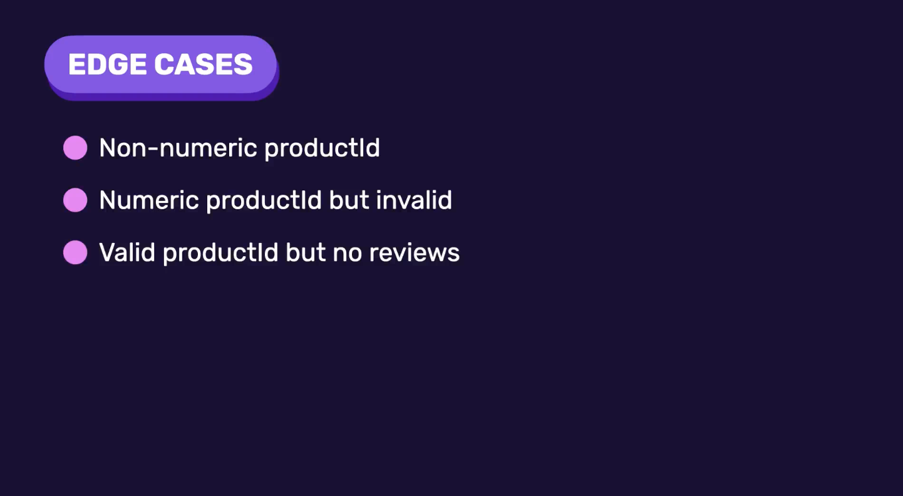

# Handling Edge Cases



## 1. Non-Numeric Product ID

Request:

```text
http://localhost:3000/api/products/a/reviews/summarize
```

Since `"a"` is not a valid number, the API returns:

```json
{ "error": "Invalid product ID" }
```

with a **400 Bad Request** status.

## 2. Numeric but Invalid Product ID

Request:

```text
http://localhost:3000/api/products/10/reviews/summarize
```

- Here, `10` is a valid number, but no product with that ID exists.
- Without validation, the API returns a **500 Internal Server Error**.

### Solution

- Before generating a summary, verify that the product exists.

Create a new repository `product.repository.ts`:

```ts
import { PrismaClient } from "@prisma/client";

const prisma = new PrismaClient();

export const productRepository = {
    getProduct(productId: number) {
        return prisma.product.findUnique({
            where: { id: productId },
        });
    },
};
```

Now, we will be using this repository directly in the controller.

### Check for a Valid Product

In the controller:

```ts
const product = await productRepository.getProduct(productId);

if (!product) {
    res.status(400).json({
        error: "Invalid product",
    });
    return;
}
```

If the product does not exist, the API now returns:

```json
{ "error": "Invalid product" }
```

instead of an internal server error.

## 3. Product with No Reviews

There are two possible approaches:

1. Return an error.
2. Return an empty string or a message indicating that no summary is available.

- Either approach is acceptable.
- In this project, we return an error because, logically, if a product has no reviews, the **Summarize** button should not be displayed in the UI.

Therefore, this situation should ideally never occur.

### Check in the Controller

```ts
const reviews = await reviewRepository.getReviews(productId, 1);

if (!reviews.length) {
    res.status(400).json({
        error: "There are no reviews to summarize.",
    });
    return;
}
```

Here, we have:

```ts
limit = 1;
```

- We only fetch **one review** because we simply want to check whether at least one review exists.
- Fetching additional reviews would be unnecessary and less efficient.
